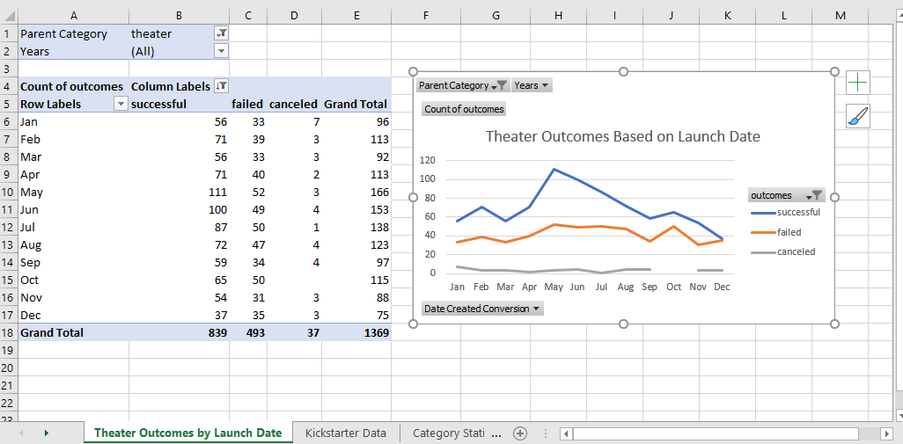
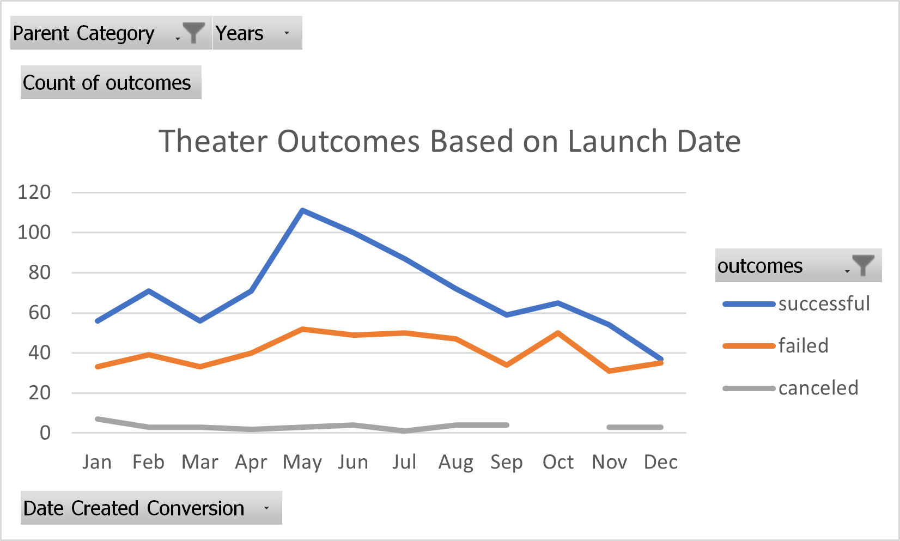
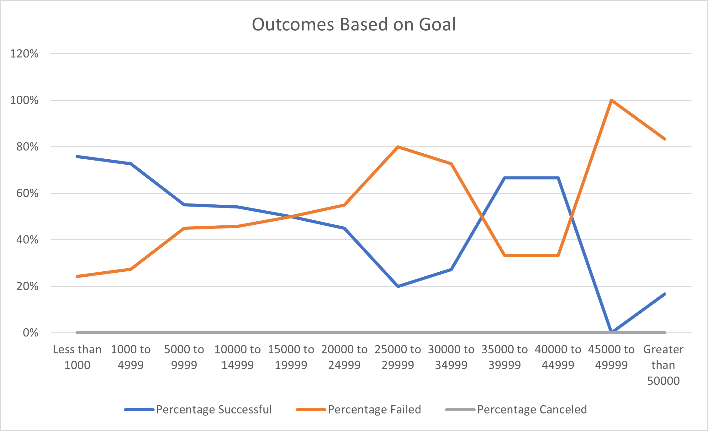
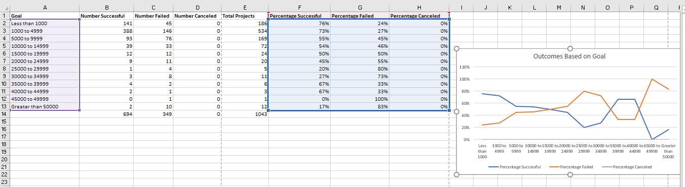

# Kickstarting with Excel

## Overview of Project

### Purpose

The purpose of this analysis was to provide Louise with information about past productions, so it can inform her strategy for successfully launching her own show.
She can now easily look at a chart and compare the outcomes of different projects based on their goals, launch dates, etc. 

## Analysis and Challenges

### Analysis of Outcomes Based on Launch Date

Louise should consider launching her play in May, because it is the month that has seen the highest number of successful launches.

### Analysis of Outcomes Based on Goals

I would advise Louise to keep her goal low, as the highest success rates are for plays who goal was under 4999.  

### Challenges and Difficulties Encountered

There were far fewer big-budget plays included in the analysis, than there were big-budget plays.  I feel more confident in the conclusions drawn about small-budget plays, because there were hundreds more to include in the analysis.

I had some difficulties with the syntax for the Outcomes Based on Goals cells, but I learned by looking up tips and by trial and error.  Being persistent got me through this challenging part of the project.

## Results

- What are two conclusions you can draw about the Outcomes based on Launch Date?

A December launch date should be avoided. A May launch date is ideal.

- What can you conclude about the Outcomes based on Goals?

It appears that cancelation is unlikely, regardless of the goal amount.  Plays with low goals are more likely to be successful.

- What are some limitations of this dataset?

There were very few big-budget plays included in the dataset.  Because there weren't any canceled plays included, this makes it hard to know anything about what makes a play more likely to be canceled.

- What are some other possible tables and/or graphs that we could create?

We could make a graph to compare success rates by country, or we could look at how success relates to the actual amount pledged to the project (not just the producers' goal amount.)
